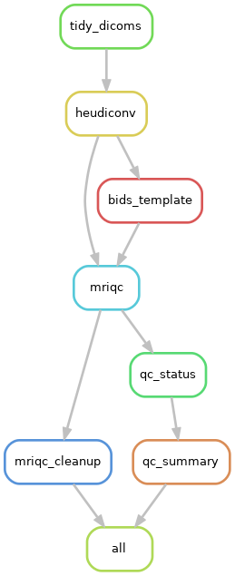

# tidySnake workflow

This repository provides a Snakemake workflow for fMRI data basic cleanup.
It is meant to handle DICOM to BIDs convertion as well as simple quality control.


## Installation

*If you are using the [NeSI](https://www.nesi.org.nz) platform, please follow the [NeSI related documentation](NESI.md).*

To run this workflow on your workstation, you need to install the following softwares:

- `apptainer`, a container system (see [installation instructions](https://apptainer.org/docs/admin/main/installation.html))
- `snakemake`, the workflow management system (see [installation instructions](https://snakemake.readthedocs.io/en/stable/getting_started/installation.html))
- `git`, the distributed version control system (see [download page](https://git-scm.com/downloads))

Clone this repository using:

```
git clone https://github.com/MataiMRI/tidySnake.git
```

Then copy the configuration file `config/config_example.yml` into `config/config.yaml`:

```
cd tidySnake
cp config/config_example.yml config/config.yaml
```

and set the following entries:

- the ethics prefix `ethics_prefix` for your input files,
- the input data folder `datadir`,
- the results folder `resultsdir`,
- the path to your [HeuDiConv](https://heudiconv.readthedocs.io) heuristic script (`heuristic` entry under `heudiconv` section).

You may want to edit other entries, in particular:

- for each software, compute resources (time, memory and threads) can be adjusted,
- for some software, additional command line arguments.

Once this configuration is finished, you can run `snakemake` to start the workflow.

Use a dry-run to check that installation and configuration is working:

```
snakemake -n
```

See the [Snakemake options](README.md#Useful-Snakemake-options) section for other useful options.


## Formats

The workflow assumes that input scan data are:

- folders or .zip files (you can mix both),
- stored in the `datadir` folder configured `config/config.yml`,
- they are named using the convention `<ethics_prefix>_<subject>_<session>`, where

  - `<ethics_prefix>` is set in [`config/config.yml`](config/config.yml),
  - `<session>` can be omitted, but will then be considered as `a`.

Within a input folder (or .zip file), only the parent folder of DICOM files will be kept when tidying the data.
Any other level of nesting will be ignored.

Once the workflow has completed, results are organised as follows:

```
<resultsdir>
└── bids
    ├── derivatives
    │   └── mriqc
    │       ├── logs
    │       │   └── ...  # log files in case MRIQC crashes
    │       ├── sub-<subject>
    │       │   ├── figures
    │       │   │   ├── sub-<subject>_ses-<session>_<entities>_<suffix>.svg
    │       │   │   └── ...
    │       │   └── ses-<session>
    │       │       ├── <modality>
    │       │       │   └── sub-<subject>_ses-<session>_<entities>_<suffix>.json
    │       │       └── ...
    │       ├── dataset_description.json
    │       ├── quality_control.tsv
    │       ├── sub-<subject>_ses-<session>_qc.yaml
    │       ├── sub-<subject>_ses-<session>_<entities>_<suffix>.html
    │       └── ...
    ├── sub-<subject>
    │   └── ses-<session>
    │       ├── <modality>
    │       │   ├── sub-<subject>_ses-<session>_<entities>_<suffix>.json
    │       │   ├── sub-<subject>_ses-<session>_<entities>_<suffix>.nii.gz
    │       │   └── ...
    │       ├── ...
    │       └── sub-<subject>_ses-<session>_scans.tsv
    ├── CHANGES
    ├── dataset_description.json
    ├── README
    └── scans.json
```

where

- `<resultsdir>` is the results directory configured in `config/config.yaml`
- `<subject>` is a subject,
- `<session>` is a subject's session,``
- `<modality>` is a modality (e.g. `anat` or `dwi`),
- `<entities>` are BIDs entities (`task`, `run`, etc.),
- `<suffix>` is a BIDs suffix, either `T1w`, `T2w`, `dwi` or `bold`.

The QC status files `sub-<subject>_ses-<session>_qc.yaml` represent the evaluation of the data quality by a user, and are meant to be edited.
By default, quality validation is set to false for all generated reports, for example:

```yaml
# T1w anatomical template
anat_template: sub-subject1_ses-session1_run-001

# runs found for each modality, replace False value with True if quality is satisfying
run-001_T1w: False
run-001_dwi: False
```

*Note:
The entry `anat_template` is only present if a T1w volume is available.
It is meant to be used by other workflows to specify an alternative anatomical template for registration purpose (e.g. use another run).*

The summary file `quality_control.tsv` aggregates all information from the individual QC status files.
This should only be used as a summary view and not edited to trigger downstream workflows.
Use the individual QC status files for that purpose.


## Workflow

The complete workflow consists of multiple steps depicted in the following graph.



The role of each step is the following:

- `unzip`: uncompressed a set of input DICOM files provided as a .zip file,
- `tidy_dicoms`: reorganise the DICOM files to ease BIDs conversion by HeuDiConv,
- `heudiconv`: convert the DICOM files to NIfTI and organise then using the BIDs convention,
- `bids_template`: generate generic template files to make the `bids` folder BIDS-compliant,
- `mriqc`: produce quality control reports for each supported modality,
- `mriqc_cleanup`: remove the work directory used by MRIQC,
- `qc_status`: generate quality control files to be edited by user.

When possible, each step is run independently for each run, task and session of a subject.


## Useful Snakemake options

View steps within workflow using rulegraph:

```
snakemake --forceall --rulegraph | dot -Tpdf > rulegraph.pdf
```

Inform `snakemake` of the maximum amount of memory available on the workstation:

```
snakemake --resources mem=48GB
```

Keep incomplete files (useful for debugging) from fail jobs, instead of wiping them:

```
snakemake --keep-incomplete
```

Run the pipeline until a certain file or rule, e.g. the `bias_correction` rule:

```
snakemake --until bias_correction
```

All these options can be combined and used with a profile, for example:

```
snakemake --profile profiles/local --keep-incomplete --until bias_correction
```

Unlock the folder, in case `snakemake` had to be interrupted abruptly previously:

```
snakemake --unlock
```

*Note: This last hint will be mentioned to you by `snakemake` itself.
Use it only when recommended to to so ;-).*
